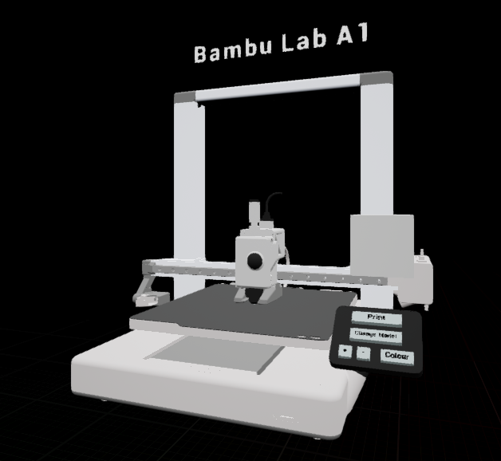

# AR 3D Printer Tutorial

**Platform:** Mobile Augmented Reality (AR)  
**Engine:** Unreal Engine  
**Device Requirements:** AR-supported mobile device (Android)

## Overview

**AR 3D Printer Tutorial** is a mobile AR application designed to teach users how to use a 3D printer—specifically the **Bambu Lab A1**—through an interactive, gamified experience. By scanning a marker in the real world, users can place a virtual 3D printer, explore its components, and simulate a print process with visual and audio feedback. This project was done as part of the 2025SS Virtual and Augmented Reality: Advanced Topics and was also used for the class 2025SS Free and Open Technologies.

   

**Creator**: Renate Zhang

## Features

### Educational Focus
- Introduces users to key components of a 3D printer
- Guides users through setup and printing in an interactive way
- Encourages hands-on learning via immersive AR interactions

### Core Functionality

- **Image Tracking (Hiro Marker)**: Printer is placed precisely using a tracked image marker
- **World-Anchored Interactions**: The printer remains fixed in AR space relative to the environment
- **UI Buttons (2D)**:
  - Start tutorial
  - Show component highlights
- **3D Buttons in AR**:
  - Interact directly with the printer (e.g. press a virtual button on the printer’s display to start printing)
- **Component Overlays**: Toggle labels and highlights for extruder, bed, spool, etc.
- **Animated Print Process**: See the printer animate a simplified print in real time

### Special Features

- **Dynamic Content Generation**: Simulate printing different models such as cubes, logos, or custom objects
- **Parametric Print Models**: Customize the model’s size, shape, and color via UI
- **Spatial Audio**: Directional sound effects simulate the printer's real acoustic behavior

## How It Works

1. Launch the app and scan a **Hiro marker** to place the virtual printer.
2. Use on-screen (2D) UI to start the tutorial or highlight printer parts.
3. Interact with **3D buttons embedded in the printer**, such as tapping the virtual screen to begin a print.
4. Customize the print model and watch the animation simulate the printing process.
5. Learn about key printer components with toggled highlights and visual overlays.

## Tech Stack

- **Unreal Engine** with AR template
- **ARCore / ARKit** for image tracking
- **Blueprints & C++** for logic and interaction
- **3D Models** of the Bambu Lab A1 printer and printable objects
- **Spatial Audio** for immersive sound feedback

